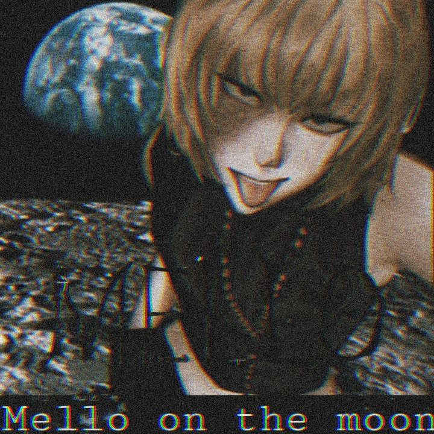

# ## MelloBot - WhatsApp Multimedia Bot

MelloBot is a multimedia WhatsApp bot inspired by Mello from Death Note, designed to handle various media formats seamlessly on the messaging platform.

---

## 𓇻Features𓇽

- **Multimedia Support:** Send and receive images, videos, audio clips, and documents effortlessly.
- **Efficiency:** Swift and precise handling of diverse media formats.
- **Sleek Interface:** Reflects Mello's signature style with an enigmatic and streamlined design.
- **Open Source:** Licensed under [MIT license], encouraging collaboration and improvements.

## Getting Started

### 𓇻SETUP𓇽

1. Fork the repo
     

2. Scan the QR and upload mello.json to your fork
     

#### 𓇻DEPLOY TO Heroku𓇽 

1. If You don't have an account in Heroku. Create a account.
     

2. Now Deploy
     

#### DEPLOY TO Replit

1. If You don't have an account in Replit. Create a account.
     

2. Now Deploy
     

## Usage
Send media files or commands through WhatsApp to trigger bot actions.
Explore various functionalities and enjoy the seamless multimedia experience.
Contributing
We welcome contributions! Feel free to submit bug fixes, suggestions, or enhancements via pull requests or by opening an issue.

## License
MelloBot is licensed under the [MIT license]. See the LICENSE file for details.

Acknowledgements
Special thanks to the Death Note series for inspiring this project.
Contributors: 

## Contributors

Thank you to the following contributors for their valuable input and contributions to MelloBot:

1. **Contributor 1**
   - GitHub: [Zeus30007](https://github.com/Zeus30007)
   - Contact: Please reach out via direct message on GitHub which i wont reply.
   - Feel free to contact via [WhatsApp](https://wa.me/+27765453057)
   - Contact: For any queries, contact [email](maiki88552@gmail.com).
